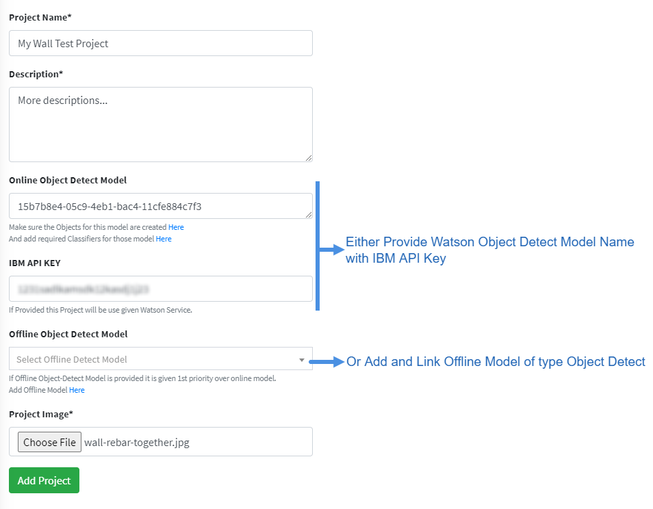
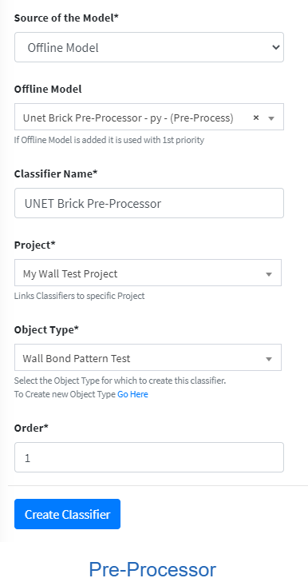
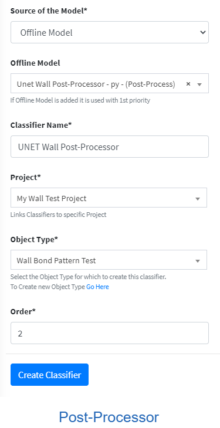
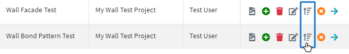
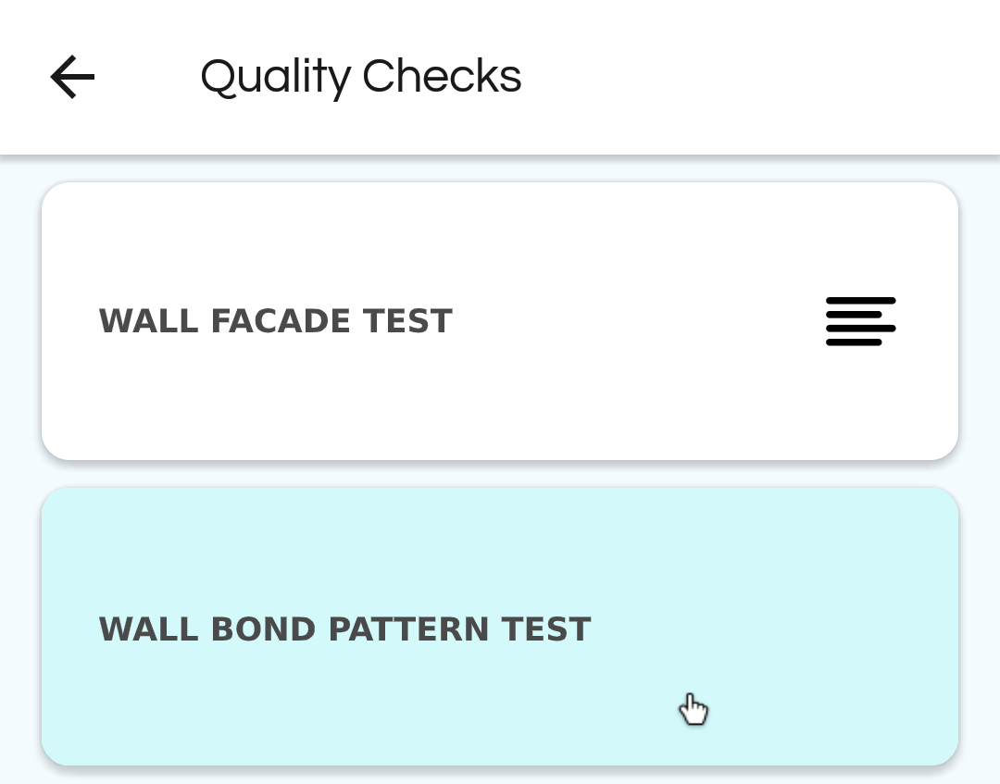

# Getting Started Introduction

This section will guide you through the steps to create a simple Project with Rebar Shape Quality
Checker. It will cover creating a project, adding and linking a classifier, adding and linking a offline model,
ordering the pipeline and testing an image via mobile application.

## STEP 1 - Register as project Admin
🛈 [More info on Login & Register](./web-application.md#login-register)

In the Registration page fill up your Details, Email and Password. Then, choose Type as **“Project Admin”** so that you can create and manage projects and models.
A Project Admin will have access to other user details, so the user must be first verified by an Admin. Wait for Admin to verify your account, so that you can login. After the account is verified you can login and access the Dashboard.
You can also register as Type **“User”** if you want. But, you can only test images after you are linked to a Project by Admin or Project Admin.
**Note**: Password needs to be strong with Upper Case, Numbers and Special Characters.

## STEP 2 - Create a New Project
🛈 [More info on Projects](./web-application.md#projects)

As you registered as a Project Admin, you can create and manage multiple projects. From the Sidebar, you can access View Projects and Create Project Page. Lets create a New Project as shown in this Image.
Fill in the Project Name, Description and Image. Now, you can either link a Watson Object Detect Model with IBM API Access Key. Or, add and link Offline Model of type Object Detect.
Then, when testing an image using the API you can choose to force an object type by providing object_type_id or choose to use this Project Object Detection Model providing the project_id.
Now, if you visit the View Projects page you can see this newly created Project with a hint that you need to add Object Types and Classifiers which we will do next. (You can also test linked Object Detect Model)

## STEP 3 - Add Object Type
🛈 [More info on Object Types](./web-application.md#object-types)

You have created a Project, but you need to add Object Types that this project will test.
For Example, in our “My Wall Test Project”, users will be able to test Wall Facade, Wall Bond Pattern etc.
These are the Object Types that can be tested. You can view and manage the Object Types as shown in Image below.

Here, we add Object Types, choose the Project and provide suitable Instruction and Image on how to perform the test.
 Now, the Classifiers/Models Pipeline for these specific Object Types can be added so that users can test.
 
## STEP 4 - Add Classifiers & Pipeline
🛈 [More info on Models / Classifiers](./web-application.md#models-classifier)

As we have added the Object Types, when we login from the Mobile Application or use API we can see the option to choose these object types for testing images. Currently, no Classifier/Model has been linked to this Object Types pipeline so the tested result will be empty. So for that, let’s start adding classifiers/models. We can add multiple models, watson models, offline models, pre/post processors and order the pipeline appropriately.
For this example, we will add models for “Wall Bond Pattern Test”. We have created two python 3 scripts, one to Pre-Process the Image of Brick Wall and the other to Post-Process and Classify the image and return GO/NOGO Result. As these are Offline Model (Not Watson), we first need to add these in Create Offline Model Page.

🛈 [More info on Offline Models](./web-application.md#offline-models)

After we have added the Pre/Post Processor appropriately we can quickly test an image and view python dependencies. Make sure that when creating Offline Models, study the Readme guide and view examples.
Here, we see that we created one Pre-Processor and one Post-Processor.

Now, finally we can create a Model/Classifier and link these offline models. You could ofcourse use Watson Model or Train yourself with Images. In the create form choose the Source of Model, fill the form as required and set the order in which to run.

Pre-Processor          |  Post-Processor    
:-------------------------:|:-------------------------:
  | 

If you want to easily change the order of the pipeline (Very useful for multiple pipelines), you can do so in the Object Type List View by clicking the **“Quick Order Classifier Icon”**.

There you can drag and arrange the Model and Classifiers easily.

## STEP 5 - Test with Mobile Application

Now, login from the Mobile Application, inside Quality Check you should be able to see “Wall Bond Pattern” in the list. Click the item, upload or capture an image of a brick wall and send to test.
If all the Classifiers ran successfully, then it should return the GO/NOGO response.

🛈 [More info on Mobile Applications](./mobile-application.md#mobile-application-introduction)

Quality Check         |  Result    
:-------------------------:|:-------------------------:
  | 

After the test, you can also view the result and pipeline specific output in the View Images/Edit/Info page from the web application.
You should now be able to add other users, link to your project, create multiple object types, classifiers, models and perform checks easily.

