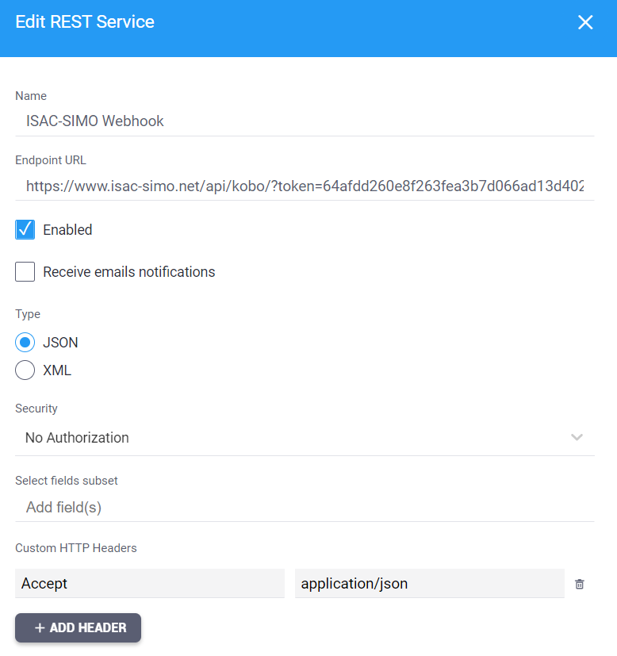
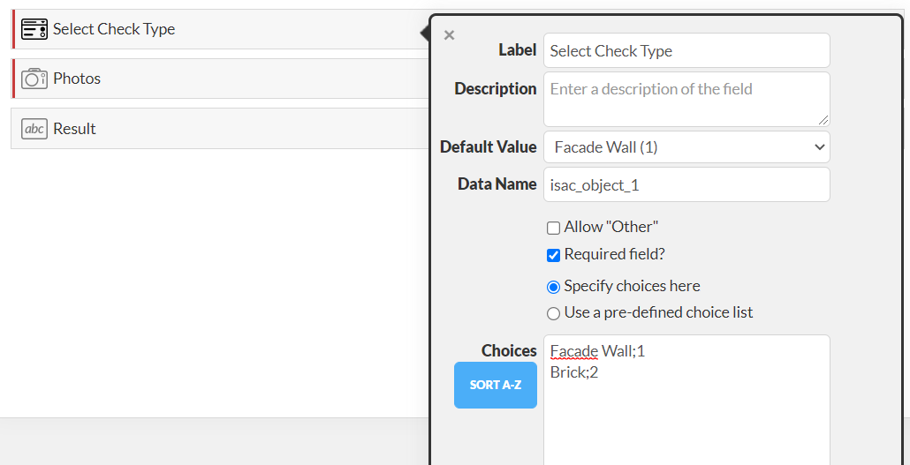
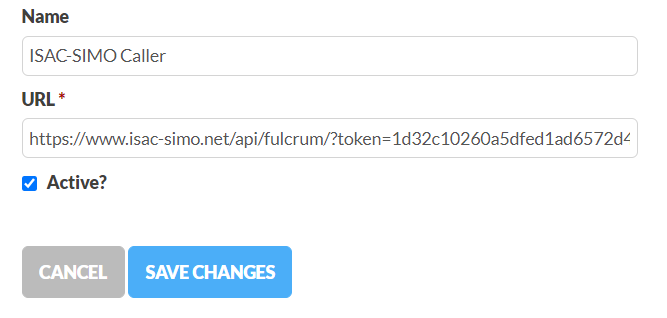
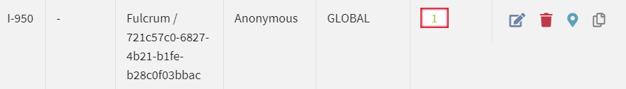
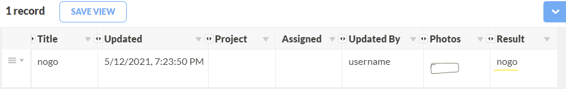

# Integration with other Application
ISAC-SIMO API is a fully featured rest service which allows other applications to use the public api to add, edit and manage data and records externally. Learn more about the API provided by ISAC-SIMO in [Mobile Api Guide](./mobile-api-guide.md){target="_blank"}.

This examples below shows a demonstration on how we can easily integrate ISAC-SIMO into different applications specially the image testing:

## KoboToolbox
▶️ [Watch Video](https://www.youtube.com/watch?v=yrza-cPK8sM){target="_blank"}

KoboToolbox (kf.kobotoolbox.org) has a feature called **Rest Services** which allows us to integrate ISAC-SIMO with which it calls our API on each new submission added to the kobo form.

First, we need to make sure that the form contains **Photo** input with the data column name set to “isac_image_xxxx” where “xxxx” can be a unique identifier. The Form can contain multiple ISAC-SIMO test-able image upload fields with “xxxx” being unique for each field. Then, it is important to have a **Select One** field with the data name set to "isac_object_xxxx" (xxxx being the same as that of Photo field). There can be choices added to this field with Text Value and valid XML value same as Check (Object Type) ID from ISAC-SIMO Dashboard. Users can choose the Check from this dropdown and upload the photo.

If you want to receive back the ISAC-SIMO test result and store it in a field in the kobo submission record, a **hidden** text input field with data column name “isac_result_xxxx” can be created. The "xxxx" value must be the same as the image upload field.

Example we can have: "isac_image_1" as photo upload field, "isac_object_1" as select one dropdown field and "isac_result_1" as the input field to store the result. **When uploading, make sure that the isac_result_xxx field is not empty (e.g. add N/A as default value as seen in above screenshot)**.

Then, in the Kobo Rest Service we can then use the following endpoint.

*https://www.isac-simo.net/api/kobo/?token=[kobo_token]&domain=[kobo_server_domain]*

The **token** should be the Kobo Toolbox auth token that can be found in Account Settings of Kobo user dashboard. Domain used by ISAC-SIMO for sending back the result is `https://kc.kobotoolbox.org` by default. If you want to change the domain and use your custom server then provide a domain query parameter. The domain in the query parameter must NOT have ending slash.

The test result can be viewed in ISAC-SIMO Dashboard with description set to “KoboToolbox / ID”. You can search by _id value here.

If “isac_result_xxxx” is valid then the result field will be set in kobo toolbox data also. It might take a few minutes for it to update / sync.

## Fulcrum
▶️ [Watch Video](https://www.youtube.com/watch?v=MFAq_r7_e4E){target="_blank"}

Fulcrum is a popular Data Collection application that has a wide range of features. Integrating ISAC-SIMO into any Fulcrum project is pretty straight-forward. Most of the logic and standard are similar to that of the KoboToolbox method mentioned above.

First, we need to make sure that the form contains a **Photos** field with the data name set to “isac_image_xxxx” where “xxxx” can be a unique identifier. The photo field for faster performance should have a single maximum photo allowed. The Form can contain multiple ISAC-SIMO test-able photo upload fields with “xxxx” being unique for each field. Then, it is important to have a **Single Choice** field with the data name set to "isac_object_xxxx" (xxxx being the same as that of Photo field). There can be choices added to this field with Text Value and valid Check (Object Type) ID from ISAC-SIMO Dashboard. Users can choose the Check from this dropdown and upload the photo.

If you want to receive back the ISAC-SIMO test result and store it in a field in fulcrum record, a read-only or hidden **text** input field with data name “isac_result_xxxx” can be created. The "xxxx" value must be the same as the image upload field.

Example we can have: "isac_image_1" as photo upload field, "isac_object_1" as single choice field and "isac_result_1" as the input field to store the result.

Fulcrum has a feature called "Webhook", with which on any event like; create, edit etc. fulcrum can call ISAC-SIMO API with form data. ISAC-SIMO performs tests on photos if valid data names are provided and updates the record if valid data name for result field is provided.

*https://www.isac-simo.net/api/fulcrum/?token=[token]*

The **token** should be the Fulcrums API token that can be found in the Settings / API section of the dashboard. If you need to authenticate an ISAC-SIMO call (for example to call private check by ID) you can add another parameter "isac_token" with JWT token generated from ISAC-SIMO users profile page.

The test result can be viewed in ISAC-SIMO Dashboard with description set to Fulcrum / ID”. You can search by id value here. Any recurring webhooks with the same ID are ignored by rate-limiting.

If “isac_result_xxxx” is valid then the result field will be set in fulcrum data also. It might take a few minutes for it to update / sync.

Any other services can easily integrate ISAC-SIMO using our Restful API service. [Learn More](./mobile-api-guide.md){target="_blank"}.