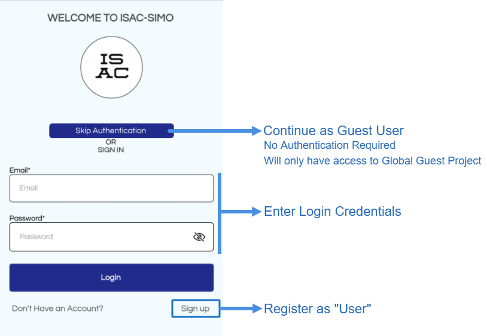
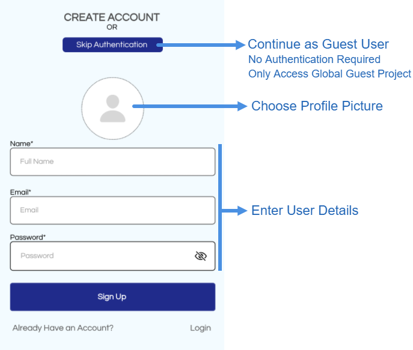
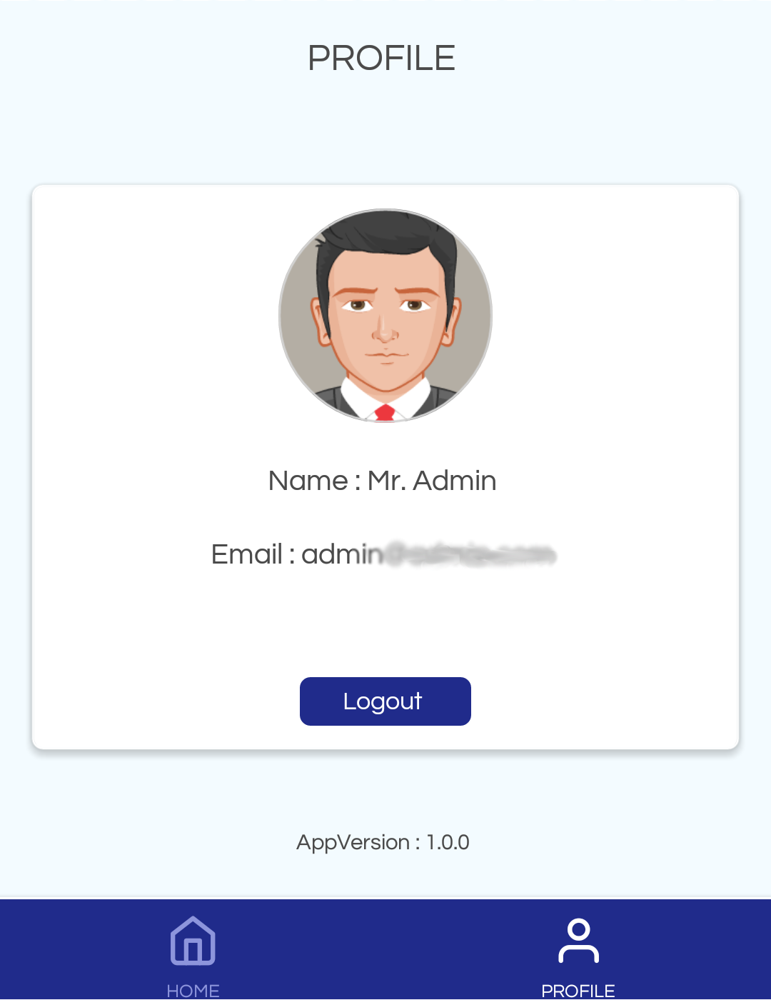
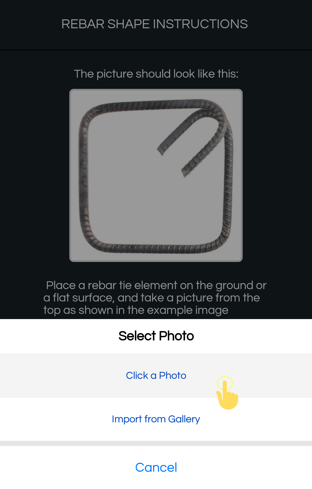
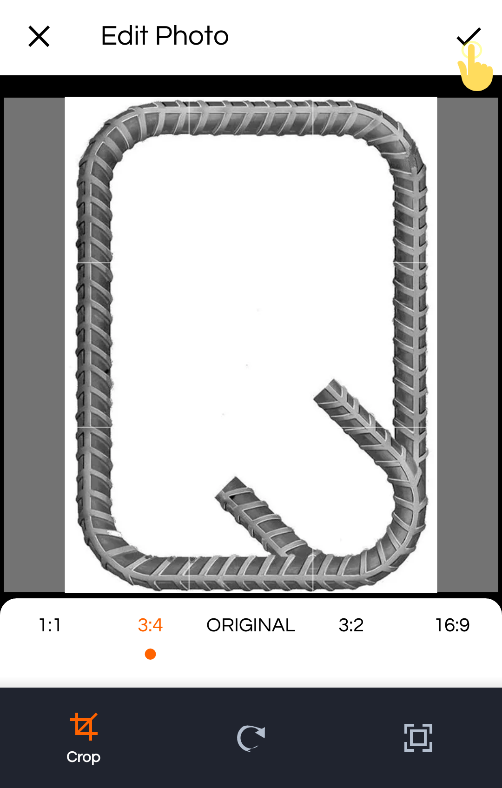
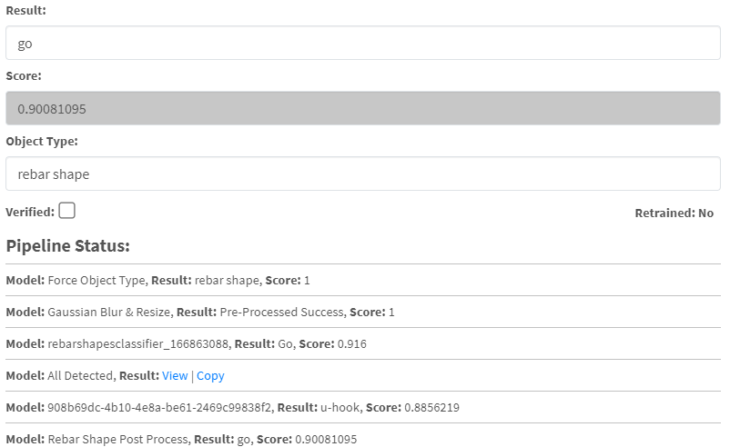

# Mobile Application Introduction
The Mobile application allows users to login, register and take or upload Images of different Objects (Wall,
Rebar etc.) to classify it as **GO** or **NOGO**. Guest Users who choose not to login will only have access to
Global Guest Project and its Object Types (If they exist). Otherwise, logged in users will only have access
to Projects and the Object Types they are linked to.

## Login & Register

 
*Login*.

 
*Register*.

## Profile
The Profile tab shows the logged in users Name, Email, Profile Image and option to Logout. Guest users will be considered a temporary Anonymous User.
 

## Home
The Home Tab is the Mobile Dashboard. There are Information, Report and Quality Check Options that can be clicked. **Quality Check** is the main option where users can test images of different objects and view the result.
 

## Quality Check 
As mentioned multiple times above, Guest Users who choose not to login will only have access to Global Guest Project and its Object Types (If they exist). While, logged in users will only have access to Projects and the Object Types they are linked to. This Quality Checks page lists all the Object Type users can test by taking photographs.
First, Choose the Object Type for which to perform a quality test. In the image below, users may choose Facade Wall, Rebar Shapes etc.
 

 
For this guide, let's choose Rebar Shape. Clicking on Rebar Shape in the list will open another page that shows Instruction and a Sample Image on how to properly capture the Image. Following the instruction will make sure that the result will be better and accurate.
Next, you can click on the **“Let’s Go”** button to capture or upload images for testing. The Uploaded image will be passed through all Classifiers/Models Pipeline that is linked to the chosen Object Type. Before uploading users can crop & edit the images.
 

Instruction            |  Upload
:-------------------------:|:-------------------------:
  | 

 
Make sure to Crop the Image so that the Object is centred and no other obstruction is visible. The image brightness, contrast, hue etc. can be easily adjusted in the next screen.

Edit Image            |  Submit Image
:-------------------------:|:-------------------------:
  | 

After clicking the **“Submit”** button the Image is sent and processed by the server. And the result and score is shown. Results can generally be Go, Nogo or No Result and score are generally 0 to 100 percent.
Score is the confidence level on the result. For Example, if the result is **“GO”** and the score is 90% like below, then it suggests that the Image passed with 90% confidence. (i.e. the Image is Okay and in this case Rebar Shape is good)

 
The Score and Result of all Pipeline is accessible in the Web Dashboard. Here, all Pipeline Classifiers and the score they returned are shown.

