# Web Application Introduction
This section provides a brief Guide on using the ISAC-SIMO Web Application. It guides you through user
registration, project management, classifier/model creation, object types and more.

## Login & Register
▶️ [Watch Video](https://www.youtube.com/watch?v=-hEAq4b0ZI8){target="_blank"}

Login            |  Register
:-------------------------:|:-------------------------:
  | 

Users can easily register themselves, and choose to be either a normal **User** or a **Project Admin**. As the name suggests, Project Admin can create or moderate Projects, Users, Models and Pipelines. While, normal users can test images and manage their own tested images.
After logging into the web application, the user is presented with a dashboard. Users can click on their name in the sidebar and open the profile page, where they can update profile information and generate API Access Tokens.

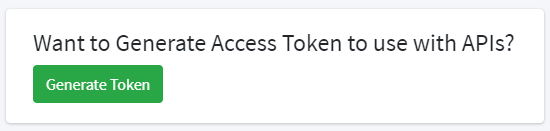

## Dashboard

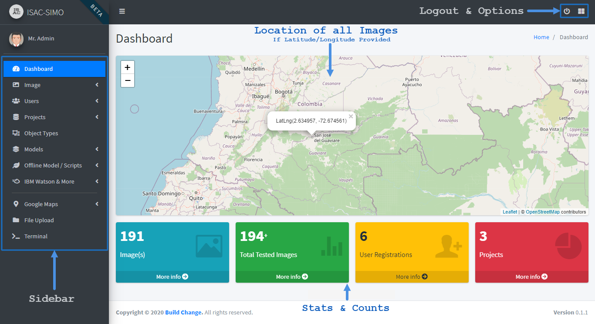
<br>
<br>


##Projects
**Permissions**: Admin (All), Project Admin (Own)
<br>
**Example**: Colombia Project, Bisaya Region Rebar Quality Verify Project etc.
<br>
> **Update:** IBM Watson API not requires **IBM Service URL**. This field needs to be filled appropriately, and the value can be found at watson dashboard.

### <span style="color:green">Create Project</span>
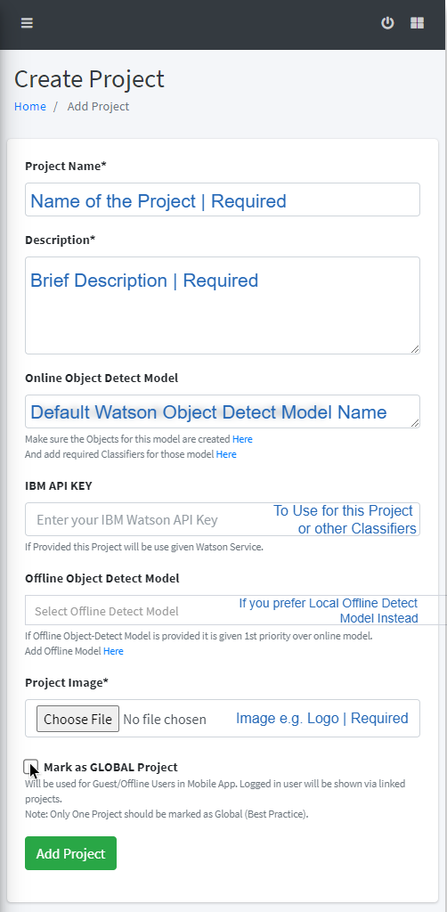
<br>
Users can choose to add Watson Object Detect Models Name and the IBM Watson API Key while creating
the Project. Or, they can also link a Local/Offline Detect Model. Then, while testing images, users can
choose the Project to test on. First the Image will be passed via provided Object Detect Model to find out
the possible object in the Image (instead of manually defining the Object Type while testing).
If Marked as **“Global”** it will be shown to Guest/Offline Users in Mobile App. Logged in users will be
shown via linked projects.
<br>
### <span style="color:green">View Projects</span>

<br>
<br>
### <span style="color:green">Test Projects, Object Detection Model</span>
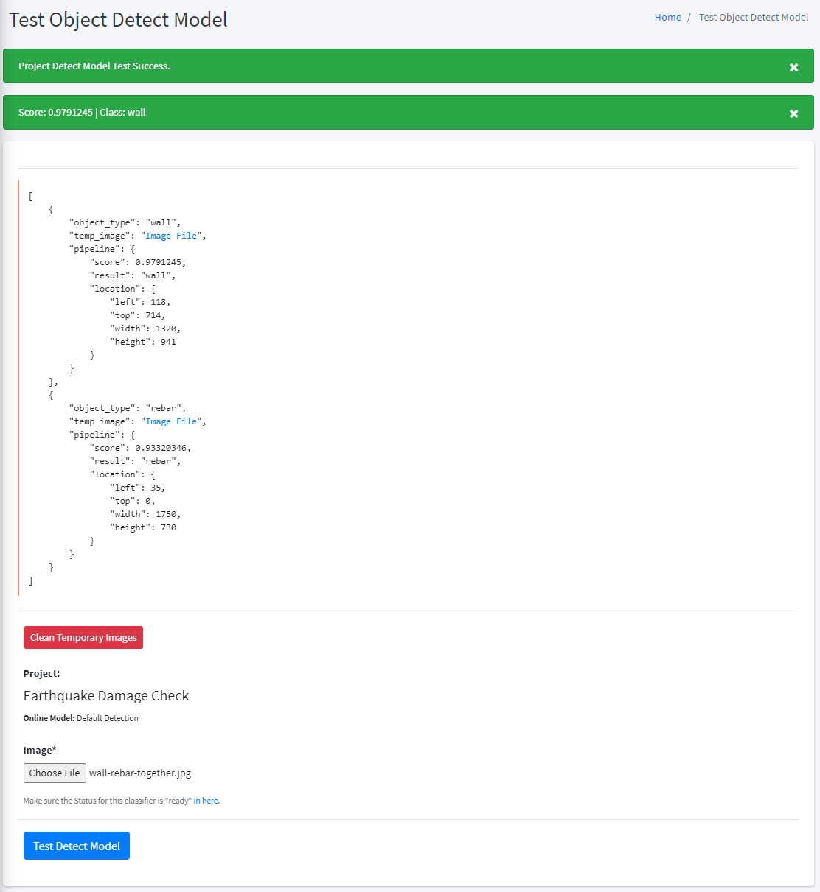

##Object Types
**Permissions**: Admin (All), Project Admin (Own & Linked)
<br>
**Example**: wall, rebar, rebar shapes etc.
<br>
### <span style="color:green">Create/Add Object Types</span>
The Name of Object Type must be unique for that specific Project. 

⚠ **If an Object Type is linked to a Project (by Admin), then the Project Admin will have full Access to it**.
<br>
### <span style="color:green">View Object Types</span>
Admin and Project Admin can manage Object Types, Change Order of Classifier Pipelines, Test Images
against this Object Type and more. Not shown in the picture below: Admin can also choose multiple countries in which certain checks should be available. Depending on mobile app users GPS location, it will show or hide certain object type from check list.
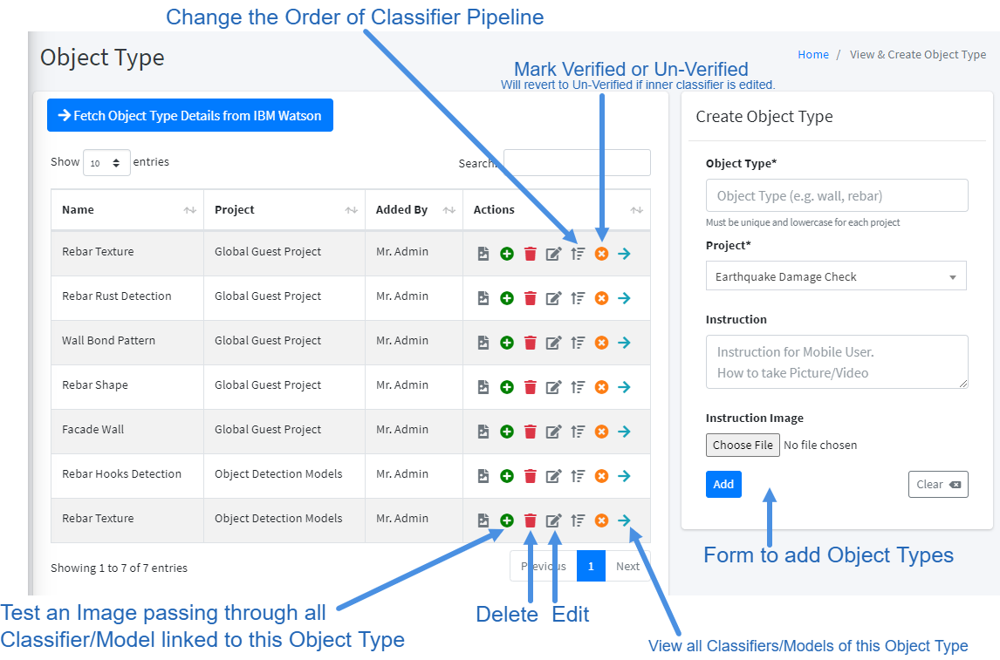
<br>


##Models / Classifier
**Permissions**: Admin (All), Project Admin (Own & Linked)

**Type**:
<ul>
<li>IBM Watson Train New Model</li>
<li>IBM Watson add Pre-Trained Model</li>
<li>Offline Model (Classifier, Pre/Post Processor)</li>
</ul>

> **Update:** IBM Watson API not requires **IBM Service URL**. This field needs to be filled appropriately, and the value can be found at watson dashboard.

### <span style="color:green">Create Models</span>
Admin or Project Admin can add a new Model. A new model can be trained by uploading zipped images and choosing to process it or not. Users can also add Pre-Trained Model by specifying the Classifier Name and IBM Watson API Key. Also, users can add and link Offline Model / Script that can be used either as a Classifier or Pre/Post Processor.
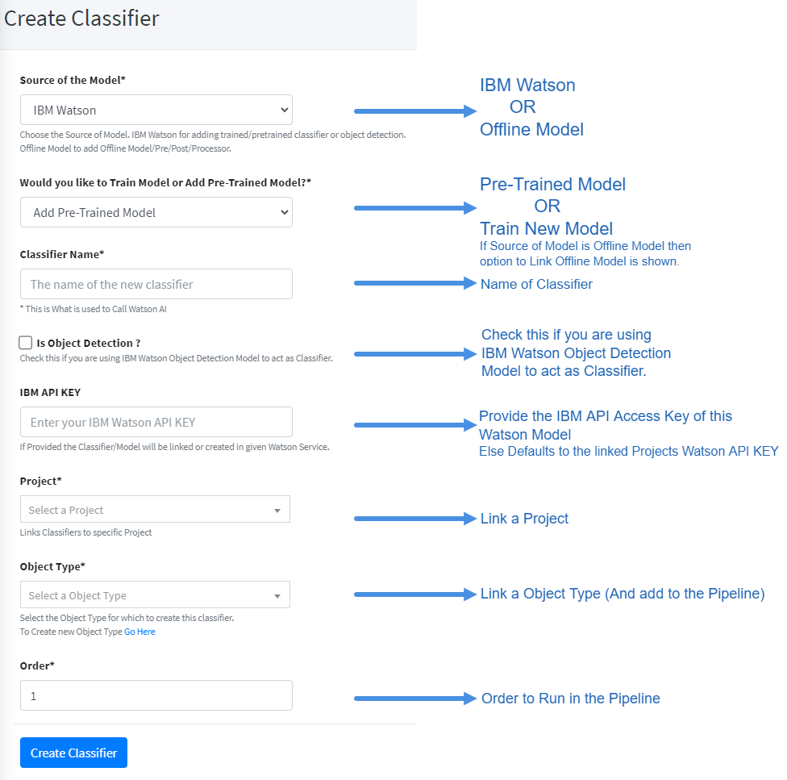
<br>

### <span style="color:green">View Models</span>
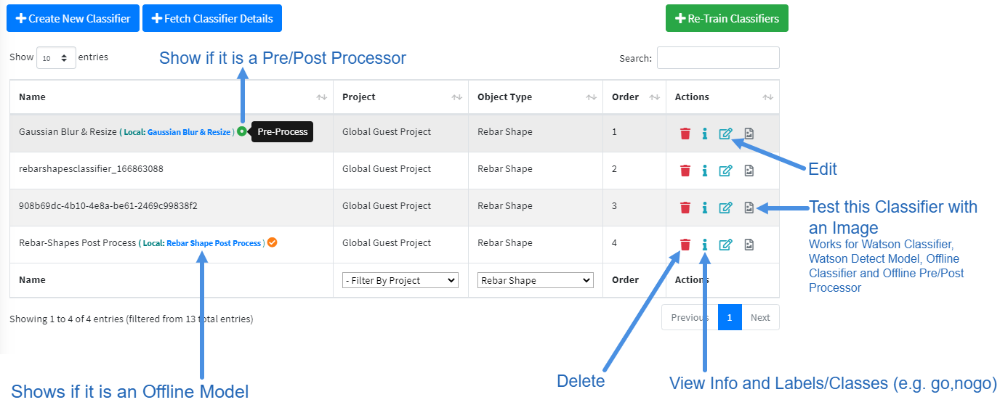
Users can easily view all the Models/Classifiers for each Project and Object Types. The Offline Model,
Labels, Pre/Post Processor Status is easily viewable. Users can also test this Specific Model for debug
purposes. As shown above in the Object Types section, Users can also easily change the Order of
Classifier in the pipeline by simple drag and drop
<br>

### <span style="color:green">Test Model</span>

<br>

##Offline Models
**Permissions**: Admin (All), Project Admin (Only Own)
<br>
**Type**:
<ul>
<li><b>Pre-Processor</b> (Python 3 Format, Useful to Process Image e.g. Gaussian Blur/Resize image etc.)</li>
<li><b>Post-Processor</b> (Python 3 Format, Alter/Calculate: Result & Score or do custom classification)</li>
<li><b>Classifier</b> (h5, keras, py format which should classify an image and return scores appropriately)</li>
<li><b>Object Detect</b> (h5, keras, py format which should return detected objects score and bound area)</li> 
</ul>
As we saw in the Models/Classifiers section above, Users can link custom Offline Models to any Classifier.
The Offline Model can be of type Processor (Pre/Post), Classifier and Object Detect. A Classifier can only
link Processor or Classifier, while Object Detect can be linked to a Project.
The Response and data receivable by Offline Model is predefined and should follow strict guidelines.

**Technical Details on creating Offline Model can be found here**.
<br>
[https://www.isac-simo.net/app/offline_model/readme.md](https://www.isac-simo.net/app/offline_model/readme.md){target="_blank"}
### <span style="color:green">Add Offline Model</span>

<br>
### <span style="color:green">View Offline Models</span>
Users can manage Offline Models and update the model file. If the offline model is python 3 format, users
can also check the dependencies used by it. Admin can if required install these dependencies via
terminal. And, just like Model and Offline Model can also be tested.

<br>
### <span style="color:green">Test Offline Models</span>
This example shows a quick test of a Preprocessor Offline Model. The Preprocessor returns a processed
image. Similarly, Postprocessor, Classifier and Object Detection will return certain JSON responses.

<br>
##File Upload
**Permissions**: Admin (All)
<br>
Admin Users can Upload other types of Files, Images, Helper Models etc using this file upload feature. After uploading the file, the user can copy the root path to that file, which can be used inside of the pre/post processor, classifiers etc. Also, users can share the file as normal web url. 
⚠ Other users can use the **root path** inside offline models, but will not have file upload access.
<br>
### <span style="color:green">Upload File</span>

<br>
### <span style="color:green">View Files</span>

<br>
##Users
**Permissions**: Admin (All), Project Admin (View/Edit Lower Level User Only)
### <span style="color:green">Add User</span>
Admin or Project Admin can create/edit or register users themselves. Admin can assign the user to any
Project, while Project Admin can assign users to their own Projects only. Project Admin will only have view
and edit access to the users (But not Admin Users).
⚠ Note that Newly registered Project Admin must be Verified by Admin before they login.
<br>
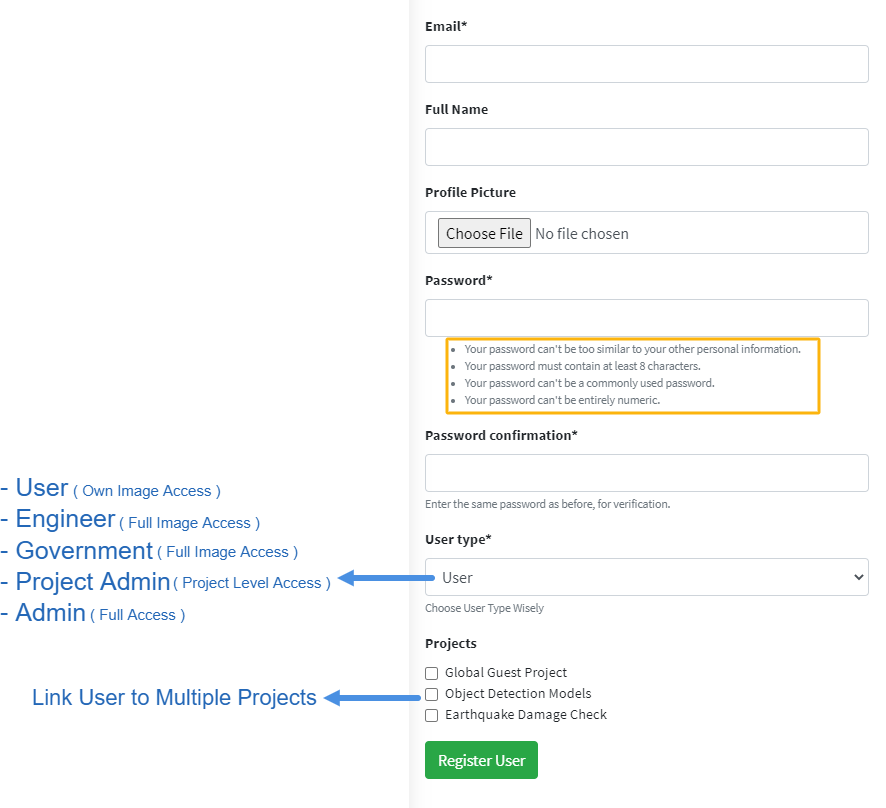
### <span style="color:green">View Users</span>
Here, Admin will have full control over all users. But, Project Admin can edit and assign users (Non admin)
to their projects; but cannot delete the users.
<br>

##Images
### <span style="color:green">Add Images</span>
Images can be tested with Mobile Applications or APIs. But, Admin also has Dashboard access to Add and
Test Images. Any Image can be tested by choosing a **Project** or an **Object Type**. If the Project is chosen
then the Object Detection Model linked in the Project will be used to detect the Object Type and is
passed through the Classifier Pipeline. Similarly, if Object Type is chosen then this is passed through the
Classifiers in this object type (without caring about the project).
<br>

⚠ You Can Choose an Object Type to Force and use that type (Or Else object detect model from chosen
Project is used to detect the object in the given image)
### <span style="color:green">View Images</span>
Admin can View and Manage all Images. Project Admin can manage images linked to their Projects only.
Government & Engineer can view linked Project Images. Normal Users can only Manage their own
Images. **Here, in the Image View page a quick preview of Image, and its result and score can be
viewed by clicking over the number list**.
<br>
The Border of Number list suggests; Green is **Go**, Red is **No Go** and Orange is **No Result**.
<br>
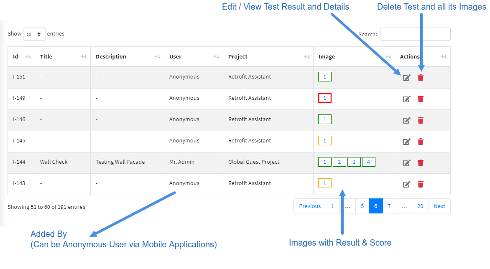
### <span style="color:green">View Image Test Result</span>
Inside the Update Image page, you can see Test Results at the bottom. Clicking on Images will Popup the Image and show brief Result, Score and Object Detected. By clicking the Info/Review icon, we can see detailed score and result for each Pipeline along with the ability to verify the result.
<br>

Test Result            |  Test Form
:-------------------------:|:-------------------------:
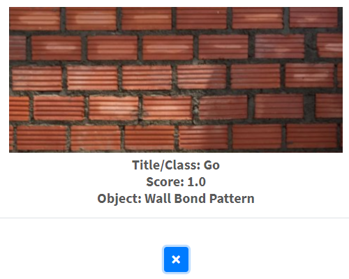  | 

##Terminal
**Permissions**: Admin (All)
<br>
Admin has the ability to run some commands like; install python packages, list packages installed etc. If an
offline classifier or processor needs a specific package or library, then Admin can install it here. The
Terminal Output is visible and all commands are sanitized properly.
<br>


##Translator
**Permissions**: Admin (All)
<br>
Only Admin has the ability to view and edit the translator. Translator can be access from the dashboard sidebar. Language can be toggle from the navbar.


*Languages list and toggler*

<br>


*Trasnlator Form*


##Miscellaneous
### <span style="color:green">Right Sidebar</span>
**Permissions**: Admin (All), Project Admin (Dump JSON Image Data)
<br>

### <span style="color:green">IBM Watson & More</span>
**Permissions**: Admin (All), Project Admin (Linked)
<br>
Feature Includes; Retraining Classifiers, Fetch Classifier Details & Training Status, Fetch Object Type
Details & Status and View Offline Model Details.
<br>

Example Response for Fetch Classifier Details:
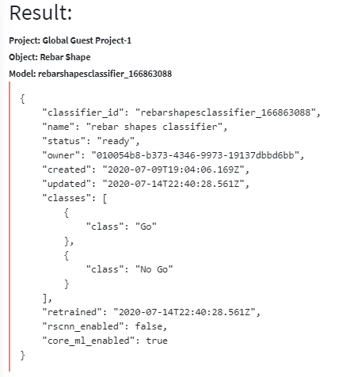
### <span style="color:green">Crowdsource Image</span>
▶️ [Watch Video](https://www.youtube.com/watch?v=6v9f-Eh5oGs){target="_blank"}

**Permissions**: Admin (All), Project Admin (All), User (Own)
<br>
The Crowdsource Feature allows anyone to upload multiple images of different Object Types. These uploaded Images can be used while Training different Models by the Admin or Project Admin. The User who uploaded the images, must confirm that they are willing to transfer the Copyright to ISAC-SIMO & agree that it can be used and shared freely.
<br>
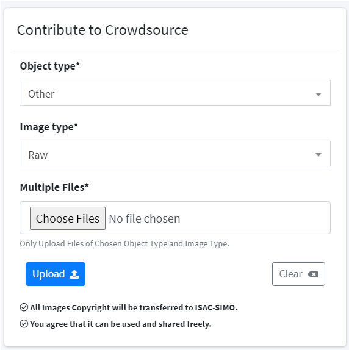
<br>
*Uploading new Contribution from Backend*.
<br>

<br>
*View / Manage Contribution Images*.
<br>
Images can be uploaded from the ISAC-SIMO Mobile Application. Similarly, any application can implement the API to integrate crowdsource functionality.

### <span style="color:green">Image Share</span>

**Permissions**: Admin (All), Project Admin (Own), User (Own)
<br>
The Image Share/Request Feature allows anyone to request image access of certain object type to Admin. The Admin can either accept or decline the image request and provide remarks if required. When the request is accepted, users who requested it are then able to download a ``JSON`` file which contains list (array) of image urls. These image url are public and can be used to download the images directly or through python scripts or notebooks.
<br>

<br>
*Requesting Image of chosen object type*.
<br>

<br>
*View / Manage Image Requests*.
<br>
Image Share when accepted allows users to download the ``JSON`` file for 30 days, then it is expired. After 60 days, the old expired image requests are purged.

The Downloaded JSON file sample is as below:
```json
[
  {
    "key": "<unique_identifer>",
    "url": "https://isac-simo-storage.s3.us-east.cloud-object-storage.appdomain.cloud/<folder>/<image_name>"
  },
  ...
  ...
]
```

From this page, users can also open Google Colab Notebook and create a clone of sample notebook created by ISAC-SIMO.

### <span style="color:green">Public Projects</span>
**Permissions**: Admin (All), Project Admin (Own), User (View/Join/Contribute)
<br>
This feature allows Admin & Project Admin to easily upgrade and share Projects publicly. To share the Project, and make it available to see and contribute by other users, it must be marked as Public (via the Project Create/Edit form)
<br>

<br>
After the Project has been marked as Public, it will immediately be visible in the Public Projects Page and users can view the Project Details and Join the Project themself.
<br>
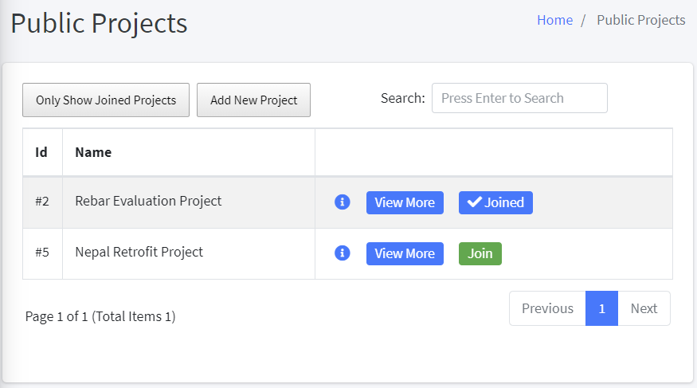
<br>
The Public Projects can be searched by Name, Description & Linked Object Types. Users can filter to show only the Joined Projects as well. It also conveniently shows the option to Join/Leave any Project. After the user Joins the Project, they will see the object types from this project in the list on the mobile application.
By clicking on the “View More” button, users can view the Object Types linked to this project as well as the Classifier Pipeline used to test the objects. They can view the Classifier Information and even download the Offline Model if it exists.
<br>
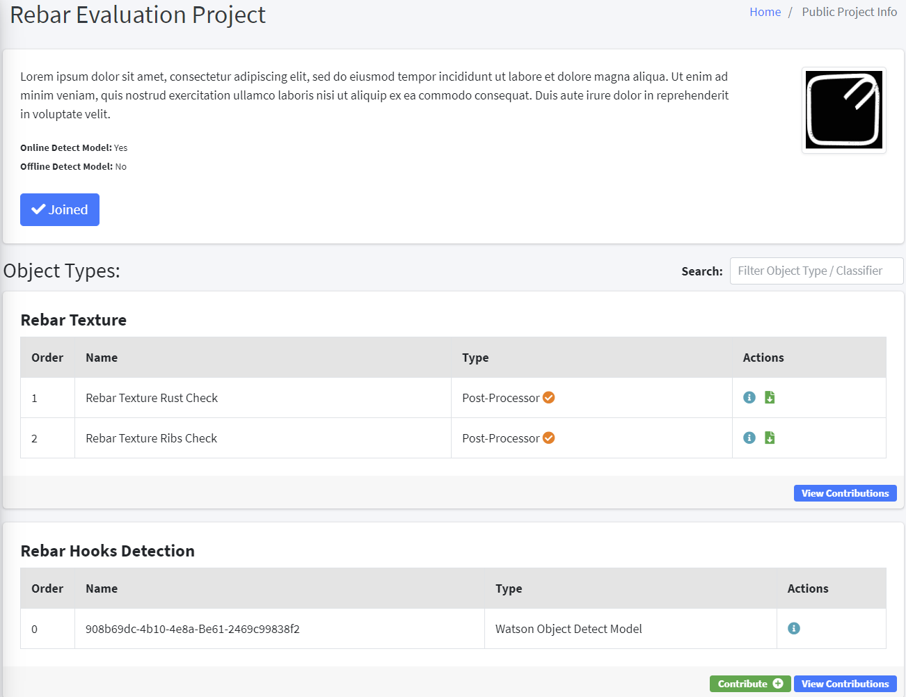
It also shows if the Classifier is Watson Model or not, as well as if it is Post-Processor, Pre-Processor, Detect Model, Watson Classifier or Local Classifier. The Search option allows you to filter by query.

Here, if Admin or Project Admin has marked any Object Type as “Wishlist” then the Contribute button will be visible. To Mark Object Type as Wishlist it can be done from Object Types Page and clicking on the little “Add to Wishlist” (Bookmark Icon) button. 
⚠ Note that, this can only be done if the Project it is linked to is marked as Public
<br>

<br>
To Contribute, as mentioned above, users can click the Contribute button (Also available inside View Contribution Page). To Contribute, the form should be filled with Title, Description explaining the contribution itself. And, can also include one file (zipped multiple files) with required documents and models. After the Contribution has been submitted, the Admin or Project Admin of that particular Project can review the contribution and can mark it as “Helpful”. Other users can then view all Helpful Contributions along with their own. (And Edit or Delete their Own Contribution if required)

Admin or Project Admin can also temporarily unmark Project as Public to stop receiving contributions. But, they will still be able to manage old contributions. (Unless removed from the Project)


<br>
*The Contribution Form*.
<br>

<br>
*View Contributions*.
<br>

<br>
*Mark Contribution as helpful (By Admin or Project Admin)*.
<br>